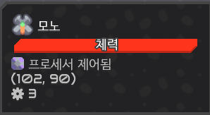

# 코드 설명
## [assign_unit_id.asm](assign_unit_id.asm)
각 유닛마다 ID(flag)를 부여하는 코드  
 
### 1) 변수 영역
```assembly
0   print "Variable Area"
1   set unit @mono
2   set max_unit 24
```
- **`unit`**  
ID(flag)를 부여할 유닛 종류  
- **`max_unit`**  
현재 보유중인 유닛 개수  
(개수 정확히 맞출 것. 생산 중이라면 냅뒀다가 초기화 코드 한번 실행 후 다시 지금 코드 실행하면 됨.)
### 2) 실행 영역
```assembly
3   print "Execution Area"
4   set i 1
5   ubind unit
6   sensor curr_uid @unit @flag
7   jump 9 notEqual curr_uid 0
8   ucontrol flag i 0 0 0 0
9   op add i i 1
10  jump 5 lessThanEq i max_unit
11  end
```
- **`set i 1` : 반복문 index**  
유닛 생성 시 자동으로 ID(flag) 값 0이 부여되기 때문에, 0은 ID보유 여부 판단값으로 놔두고 1부터 시작함.
- **`ubind unit` : 유닛 바인드**  
프로세서가 컨트롤 할 유닛 바인드 (호출될 때 마다 랜덤으로 한마리가 선택됨)
- **`sensor curr_uid @unit @flag` : 바인드 된 유닛의 현재 ID(flag) 값 반환**  
- **`jump 9 notEqual curr_uid 0` : 현재 유닛의 ID가 할당 되었는지 여부 판단**  
현재 유닛의 ID가 0이면 `8`번 라인으로 넘어감.  
현재 유닛의 ID가 0이 아니면(이미 ID가 부여됨) `9`번 라인으로 건너뜀.
- **`ucontrol flag i 0 0 0 0` : ID(flag)값 부여**  
유닛의 ID(flag)값을 `i`로 지정.
- **`op add i i 1` : `i`를 1 증가시킴**
- **`jump 5 lessThanEq i max_unit` : 보유중인 유닛 개수만큼 반복**